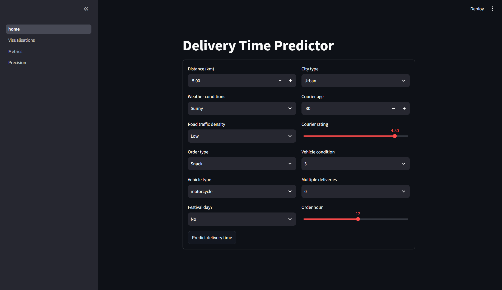
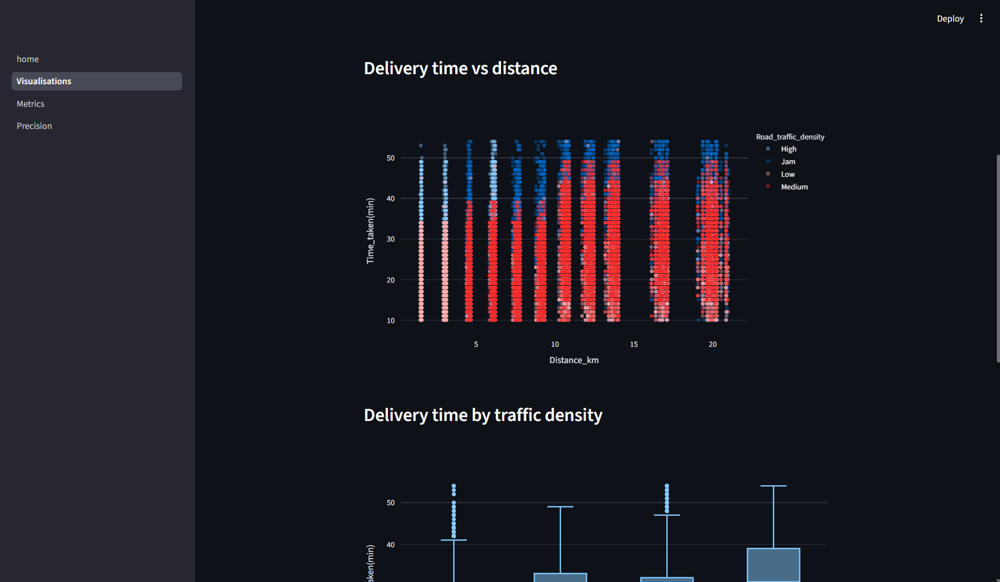
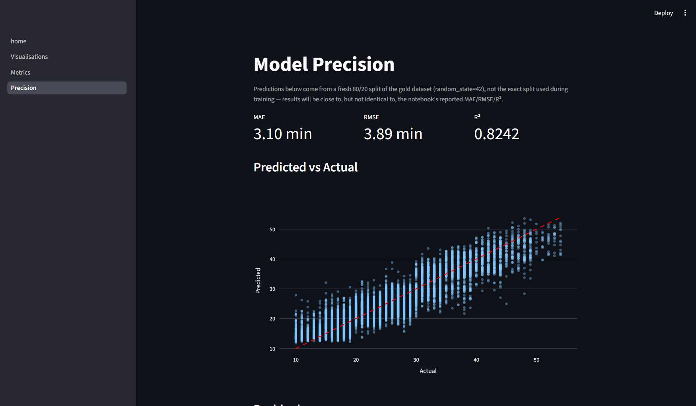

# DeliveryETA

Prédiction du temps de livraison (en minutes) pour une entreprise de logistique alimentaire, à partir des informations du livreur, des coordonnées GPS du restaurant et du client, de la météo, du trafic, du type de véhicule et du type de commande.

## Jeu de données

- `delivery_data.csv` — 45 593 lignes brutes, 20 colonnes (données réelles de livraison en Inde).
- Après nettoyage : 41 953 lignes, 18 colonnes, 0 valeur manquante.

## Démarche

1. **Nettoyage** (`notebooks/01_cleaning.ipynb`) : extraction des valeurs numériques polluées par du texte (ex. `"(min) 24"`), marqueurs `"NaN"` textuels, correction des erreurs de signe GPS et suppression des lignes GPS placeholder irrécupérables, notes invalides (>5), imputation médiane/mode, reconstruction des `Time_Orderd` manquants.
2. **Analyse exploratoire** (`notebooks/02_eda.ipynb`) : statistiques descriptives, distribution de la cible, matrice de corrélation. Création de `Distance_km` (haversine), `Order_Hour`, `Is_Weekend`, `Is_Rush_Hour`, et `Distance_x_Traffic` (corrélation 0.448, meilleur prédicteur individuel).
3. **Modélisation** (`notebooks/03_modeling.ipynb`) : split 80/20, pipeline OneHotEncoder + StandardScaler, comparaison de 4 modèles.
4. **Optimisation** (`notebooks/04_hyperparameter_tuning.ipynb`) : GridSearchCV sur XGBoost (162 combinaisons).

## Résultats

| Modèle | R² |
|---|---|
| RandomForest | 0.8186 |
| XGBoost | 0.8184 |
| GradientBoosting | 0.7629 |
| LinearRegression | 0.5780 |

XGBoost retenu pour l'optimisation (R² quasi identique à RandomForest, ~15-20x plus rapide à entraîner).

**Modèle final (XGBoost optimisé)** — `learning_rate=0.05, max_depth=8, n_estimators=200, subsample=1.0` :
- MAE : 3.10 min
- RMSE : 3.90 min
- R² (test) : 0.8236
- R² (train) : 0.8688 (écart faible, pas de surapprentissage significatif)

## Application Streamlit

Interface pour un utilisateur non technique : saisie des détails de la commande, estimation du temps de livraison en temps réel, pages de visualisation des données, des métriques du modèle, et de la précision (prédit vs réel, résidus).






## Installation et exécution

```bash
git clone https://github.com/jerymy-k/DeliveryETA.git
cd DeliveryETA
uv sync
uv run streamlit run app/Home.py
```

## Structure du projet

```
data/{bronze,silver,gold}/     # données brutes, nettoyées, enrichies
models/                        # pipeline entraîné (xgboost_tuned_pipeline.joblib)
notebooks/                     # 01_cleaning, 02_eda, 03_modeling, 04_hyperparameter_tuning
src/deliveryeta/                # cleaning.py, features.py, predict.py, paths.py
app/                           # Home.py + pages/ (Streamlit)
```

## Stack technique

Python, pandas, scikit-learn, XGBoost, Streamlit, joblib, uv.